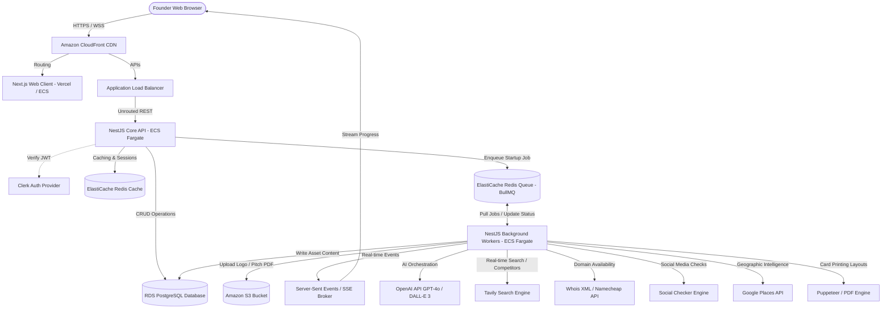

# System Architecture Specification
## Bravio: Turn your business idea into a startup in 60 seconds

---

## 1. High-Level Architecture Diagram
The diagram below outlines the physical and logical layout of the Bravio startup launcher system.



---

## 2. Component Architecture
Bravio is divided into four highly-decoupled component tiers:

1. **Presentation Layer (Next.js Client)**:
   - High-fidelity, responsive client-side SPA.
   - Built on React 18 with TypeScript, Tailwind CSS, and Shadcn UI.
   - Listens to Server-Sent Events (SSE) from the backend to display real-time, multi-step generation statuses (e.g., "Naming Brand...", "Designing Logo...", "Conducting Trademark Search...").

2. **Core API Gateway Layer (NestJS Web Application)**:
   - Serves as the REST API engine.
   - Validates requests, enforces route-level rate limits, parses database CRUD operations, and manages billing authorizations.
   - Dispatches resource-heavy AI generation workflows onto the background queue immediately, returning an HTTP `202 Accepted` response to the client.

3. **Message & State Queue Layer (BullMQ & Redis)**:
   - Handles load leveling. Ensures that massive bursts of startup generation requests are queued gracefully and executed according to pricing tier priority.
   - Holds ephemeral job tracking state, execution progress, and inter-process signals.

4. **Asynchronous Execution Workers (NestJS Background Workers)**:
   - Stateless workers dedicated to running the sequential and parallel AI execution chains.
   - Interfaces directly with external providers: OpenAI, Tavily, Whois, Google Places, and AWS S3.
   - Triggers server-sent event (SSE) updates to push task statuses directly back to the active user session.

---

## 3. Microservices vs. Monolith Decision
Bravio utilizes a **Modular Monolith** architecture with split runtime roles (API Web App vs. Queue Worker):

### Why Not Distributed Microservices?
1. **Network Overhead**: Microservices would introduce significant networking latency (RPC, REST, gRPC) between small, interdependent features (e.g., logo generation, domain checking, brand book compilation).
2. **Operational Cost**: Managing separate deployment pipelines, service meshes (Linkerd/Istio), and decentralized database instances is highly inefficient for a startup launch lifecycle.
3. **Data Consistency**: A single PostgreSQL database with strong foreign keys guarantees transactional integrity across the 20 distinct startup assets.

### How We Decouple Roles
We maintain a single codebase (shared types, shared Prisma client, shared logic) but compile and deploy **two separate runner profiles**:
- **API Profile**: High-concurrency web server optimized for standard CRUD operations and low memory usage.
- **Worker Profile**: High-memory, highly multi-threaded node dedicated to long-running network transactions and heavy data processing.

---

## 4. Service Responsibilities

### 4.1 Projects Service
- Handles workspace orchestration.
- Creates new empty projects, retrieves historical projects, and handles safe cascading deletion of projects and all their associated generated children.

### 4.2 AI Generation Orchestrator Service
- Manages prompt composition, parsing, and execution order.
- Utilizes structural JSON schemas via OpenAI Structured Outputs to prevent model hallucination or corrupted data.

### 4.3 Scraping & Real-time Verification Service
- Dispatches parallel workers to query domain availability and social handles.
- Calls Tavily to pull authentic real-time competitor lists based on the startup's category.

### 4.4 Asset Export Service
- Interfaces with server-side Puppeteer instances to capture mockups and compile PDF outputs (Pitch Decks, Brand Books, Business Cards).
- Uploads compiled media directly to AWS S3, returning secure CloudFront Signed URLs.

### 4.5 Subscription & Billing Service
- Coordinates with Stripe Webhooks to sync premium customer attributes to the PostgreSQL database.
- Enforces token/generation allowances during job scheduling.

---

## 5. Event Flow
Below is the sequential diagram of the startup launch event flow:

```
[Web Client]             [API Gate]            [Redis Queue]          [Worker Node]          [AI/External]
     |                       |                       |                      |                      |
     |--- POST /projects --->|                       |                      |                      |
     |    (Startup Prompt)   |--- Create Record ---->|                      |                      |
     |                       |    in PG (Status: PND)|                      |                      |
     |                       |                       |                      |                      |
     |                       |--- Enqueue Job ------>|                      |                      |
     |<-- HTTP 202 Accepted -|    (Queue: launch)    |                      |                      |
     |                       |                       |                      |                      |
     |--- Get SSE Stream --->|                       |--- Pick up Job ----->|                      |
     |   (Real-time Updates) |                       |                      |--- Gen Name/Brand -->|
     |                       |<-- Push SSE Msg ------|<-- Progress 10% -----|                      |
     |<-- Stream: Naming ----|                       |                      |<-- Names JSON -------|
     |                       |                       |                      |                      |
     |                       |                       |                      |--- Check Domains --->|
     |                       |                       |                      |--- Gen Copy -------->|
     |                       |<-- Push SSE Msg ------|<-- Progress 50% -----|                      |
     |<-- Stream: Copy/Dom --|                       |                      |                      |
     |                       |                       |                      |--- Gen Logo Concept->|
     |                       |                       |                      |<-- Rendered SVG/PNG--|
     |                       |                       |                      |--- Upload S3 -------->
     |                       |                       |                      |                      |
     |                       |                       |                      |--- Save to PG ------->
     |                       |<-- Push SSE Msg ------|<-- Progress 100% ----|    (Status: CMP)     |
     |<-- Stream: Finished --|                       |                      |                      |
     |                       |                       |                      |                      |
```

---

## 6. Data Flow
1. **Request Intake**: Client initiates creation. Request body containing the idea string undergoes payload validation (`class-validator` schema).
2. **Token Check**: API queries PostgreSQL user table for active subscription state or credit allocation. If invalid, returns a `402 Payment Required` exception.
3. **Draft Compilation**: Project is saved in `projects` with status `GENERATING`. An initial row in `startup_generations` is written as the primary log anchor.
4. **Queue Push**: Job payload containing `{ projectId: string, prompt: string, tier: string }` is serialized and pushed to BullMQ.
5. **Worker Execution**: Worker parses the payload, fetches prompt templates, and makes multi-threaded downstream requests.
6. **Persistence**: Generated objects are written to their respective tables (`brand_assets`, `logos`, `marketing_assets`) with direct foreign keys to `project_id`.
7. **Hydration**: Client receives a `COMPLETED` message over SSE, performs a local state re-fetch, and renders the fully-hydrated dashboard from the database.

---

## 7. Queue Architecture
Bravio leverages **BullMQ** running on Redis for state-reliable queue management:

### 7.1 Queue Profiles
- **`startup-launch`**: Main queue. Processes initial generations. Concurrency rate capped at `10` simultaneous workers per server node to manage downstream API rate limits.
- **`asset-generation`**: Secondary queue. Handles ad-hoc requests such as "regenerate logo" or "generate extra ad copies" to keep the main queue clear.

### 7.2 Job Settings
- **Attempts & Retries**: 3 retries maximum.
- **Backoff Strategy**: Exponential backoff (`backoff: { type: 'exponential', delay: 2000 }`). Ensures OpenAI rate limiting (HTTP 429) resolves before retrying.
- **Job Timeout**: Hard limit at 120 seconds. If a job hangs beyond this limit, it is forcefully failed, and the project status is marked as `FAILED` to prevent memory leaks.
- **Priority Scaling**: BullMQ handles priority weights:
  - `Priority 1 (Premium Users)`: Job immediately placed at the head of the active worker queue.
  - `Priority 2 (Free Users)`: Job placed in standard FIFO queue order.

---

## 8. Storage Architecture
Bravio uses a hybrid storage paradigm to maximize speed and durability:

| Storage Type | Technology | Purpose | Data Policy |
| :--- | :--- | :--- | :--- |
| **Relational Database** | RDS PostgreSQL | Core transactional models, relations, audit logs, subscription tracking. | Persistent, backed up daily, multi-AZ replication. |
| **Object Store** | Amazon S3 | Visual brand assets, logos, PDF exports, layout mockups. | Immutable keys, accessed via CloudFront CDN. |
| **In-Memory Cache** | Redis | Queue state, API session caches, rate limit counter arrays. | Ephemeral, volatile, high throughput. |

---

## 9. AI Orchestration Architecture
Executing 20 sequential and parallel AI assets effectively requires a structured DAG (Directed Acyclic Graph) engine:

```
                  +--------------------------------+
                  |  [Node 0] User Business Prompt |
                  +--------------------------------+
                                  |
                                  v
                  +--------------------------------+
                  | [Node 1] Core Brand Engine LLM |
                  |   - Name suggestions           |
                  |   - Brand voice & taglines     |
                  +--------------------------------+
                    /             |              \
                   /              |               \
                  v               v                v
      +-----------------+  +--------------+  +-------------------+
      | [Node 2] Domain |  | [Node 3] Logo|  | [Node 4] Strategy |
      |  Real-time API  |  |  DALL-E PNG  |  |  - Pricing        |
      |  Checks         |  +--------------+  |  - Roadmap        |
      +-----------------+         |          |  - Business Canvas|
              |                   v          +-------------------+
              |          +---------------+             |
              |          | [Node 5] S3   |             |
              |          |  Upload Engine|             |
              |          +---------------+             |
              \                   |                   /
               \                  v                  /
                \-> +----------------------------+ <-/
                    | [Node 6] Digital Identity  |
                    |   - Landing Page SEO Copy  |
                    |   - Marketing Ads & Post   |
                    |   - Competitors Analysis   |
                    +----------------------------+
                                  |
                                  v
                    +----------------------------+
                    |  [Node 7] Final Synthesis  |
                    |   - Save all to PostgreSQL |
                    |   - Stream 100% SSE Event  |
                    +----------------------------+
```

### Key AI Techniques
1. **JSON Schema Enforcement**: We do not rely on standard regex parsing of markdown outputs. We pass a strict JSON schema via NestJS Prisma types directly to the OpenAI API using the `response_format: { type: "json_object" }` or structured schema declarations to ensure outputs parse successfully into DB columns.
2. **Prompt Modularization**: Prompts are stored in a secure folder as typed templates, ensuring version control and easy testing of prompt updates.
3. **Context Injection**: Each successive node in the DAG inherits the outputs of the previous node. Node 6 (Landing Page) is injected with the exact Brand Name chosen and the specific pricing tiers generated in Node 4, guaranteeing complete coherence across all startup assets.
